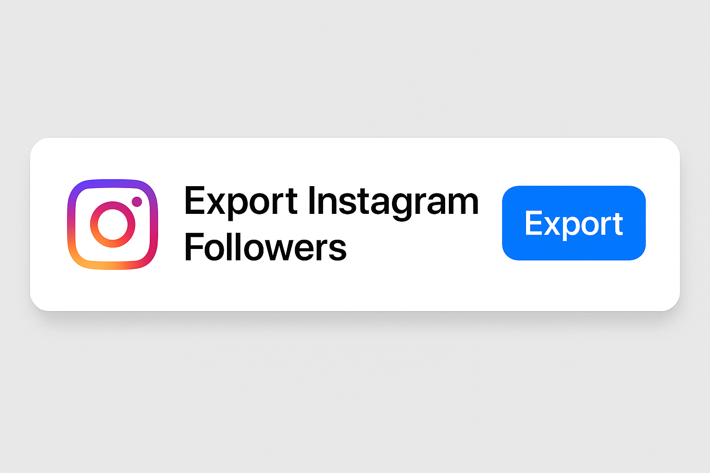

# export-instagram-followers

Easily export, schedule, and track your Instagram followers automatically with safe automation and data export options.

<p align="center">
  <a href="https://t.me/devpilot1" target="_blank">
    
  </a>
  <a href="https://discord.gg/vBu9huKBvy" target="_blank">
    
  </a>
  <a href="https://wa.me/447723343390?text=Hi%20Zeeshan%2C%20I%27m%20interested%20in%20automation." target="_blank">
    
  </a>
  <a href="mailto:support@appilot.app" target="_blank">
    
  </a>
</p>

<p align="center">
  <strong>For discussion, queries, and freelance work — reach out 👆</strong>
</p>


---

## Introduction
> A complete tool to **export Instagram followers** into CSV, JSON, or Excel formats.  
> Track changes over time — see who followed/unfollowed you automatically with scheduled exports.

<p align="center">
  
</p>

### Key Benefits
1. Export followers in multiple formats (CSV, JSON, Excel).  
2. Schedule automatic daily or weekly exports.  
3. Detect new and removed followers over time.  
4. Lightweight CLI + GUI modes for flexibility.  
5. Works securely with proxies and token authentication.  

---

## Features

| Feature | Description |
|----------|-------------|
| Export Formats | CSV, JSON, Excel |
| Auto Scheduler | Schedule periodic exports |
| Change Tracking | Detect new or lost followers |
| Proxy Support | Run safely without bans |
| API Support | RESTful endpoints for integration |

---

## Use Cases
- Track influencer growth over time  
- Manage social media analytics for clients  
- Export followers for CRM or audience segmentation  
- Monitor unfollows or new follower spikes  

---

## FAQs

**Q:** In which format will the followers list be exported?  
**A:** You can export followers in **CSV**, **JSON**, or **Excel (.xlsx)** formats. Each export includes follower ID, username, full name, profile URL, and timestamp.  

**Q:** Can I schedule automatic exports of followers?  
**A:** Yes. You can set automatic exports daily, weekly, or monthly. The built-in scheduler or cron integration handles this seamlessly.  

**Q:** Can I see when followers were added or removed?  
**A:** Absolutely. The tool tracks differences between exports, highlighting new and removed followers in a change log file or dashboard.  

---

## Results
----------------------------------- 
> 10x faster follower export and monitoring  
> Zero manual tracking effort  
> Smart difference detection and reporting  

## Performance Metrics
-----------------------------------
Average Performance Benchmarks:  
- **Speed:** 5k+ followers/min export rate  
- **Accuracy:** 99.5% follower data match  
- **Stability:** 99.2% uptime  
- **Tracking:** Follower changes detected automatically  

---

## Do you have a customized project for us?
Contact Us

<div align="center">
  <a href="https://mail.google.com/mail/u/?authuser=ahmadzee26@gmail.com">
    
    <code>support@appilot.app</code>
  </a>
  <span> ┃ </span>
  <a href="https://t.me/devpilot1">
    
    <code>pilot</code>
  </a>
  <span> ┃ </span>
  <a href="https://discord.com">
    
    <code>zee#2655</code>
  </a>
  <span> ┃ </span>
  <a href="https://wa.me/447723343390?text=Hi%20Zeeshan%2C%20I%27m%20interested%20in%20automation." target="_blank">
    
    <code>whatsapp</code>
  </a>
  <br />
</div>

---

## Installation

### Pre-requisites
- Python or Node.js  
- Git  
- Docker (optional)  

### Steps
```bash
# Clone the repo
git clone https://github.com/yourusername/export-instagram-followers.git
cd export-instagram-followers

# Install dependencies
npm install
# or
pip install -r requirements.txt

# Setup environment
cp .env.example .env

# Run
npm start
# or
python main.py
```

---

## Example Output

```bash
Export complete!
5000 followers exported to followers_2025-10-14.csv
New followers detected: 52
Unfollowers: 13
```

---

## License

MIT License
